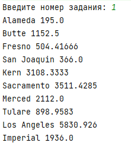
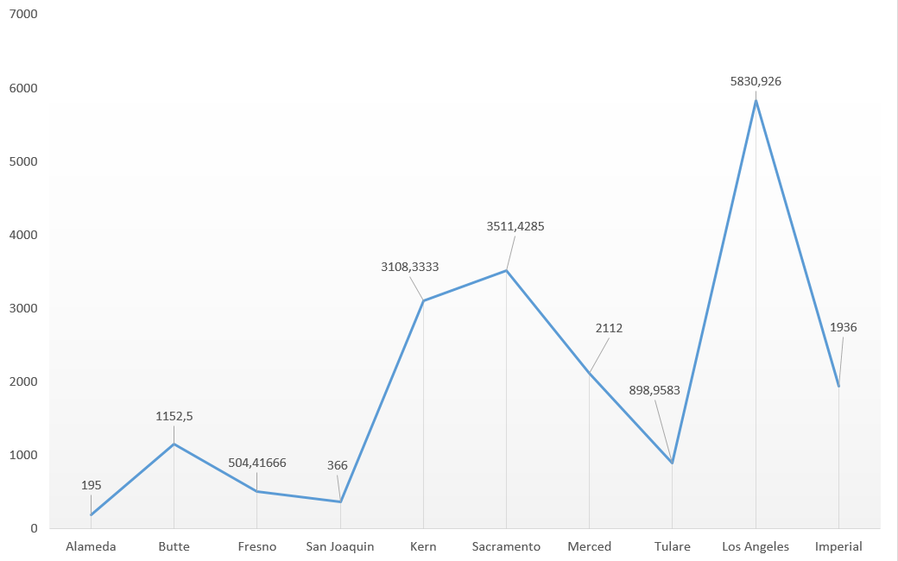
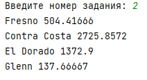
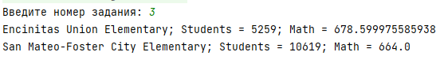
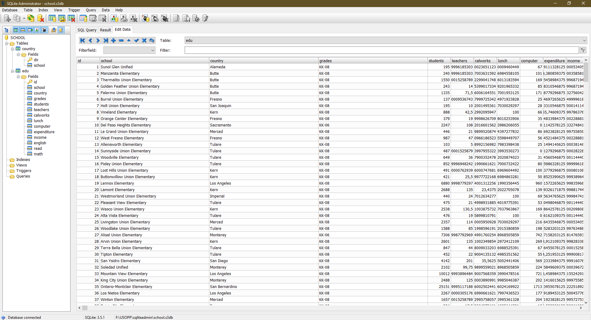
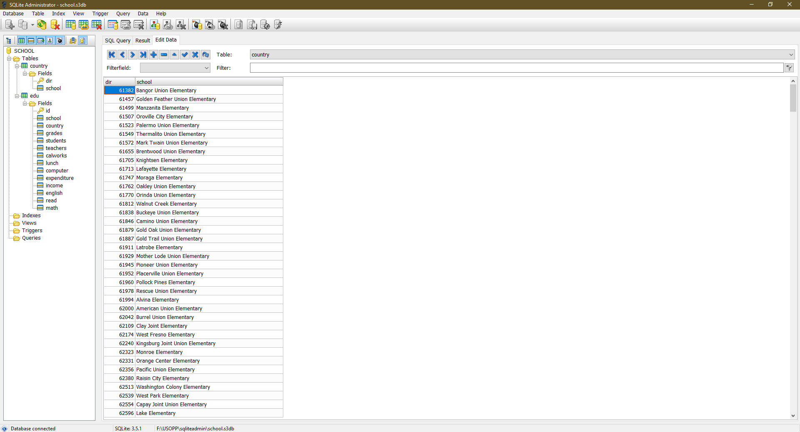

# Проект по джаве
1. Скачиваем csv-файл нашего варианта
2. Создаём проект в Intellij Idea, именно этой средой программирования мы будем пользоваться
для создания проекта
3. Создаём класс Сsv для обработки csv-файла
4. Затем мы создаём два класса District и Education для инициализации объектов, где будут храниться данные
из csv-файла
5. Скачиваем Sqlite administrator и создаём базу данных для нашего проект
6. Создаём две таблицы, чтобы организовать базу данных в третью нормальную форму
7. Для того чтобы работать с БД, мы создаём класс Connect, в котором и будет подключение к БД и обработка
всех запросов
8. Создаём метод Connect в классе Connect для подключение к нашей БД
9. Затем чтобы заполнить нашу БД данными из csv-файла мы создаём метод insertToDB
10. Когда мы уже сделали главную подготовку к проекту, мы переходим к выполнению заданий
11. Разрабатываем три метода Task1, Task2, Task3 в которых и будут отправляться и обрабатываться запросы,
а также методы будет выводить ответы нашего задания
12. Последняя часть нашего проекта - это запуск методов задания. Мы создаём файл Tasks.java,
которая при запуске просить в консоле написать номер задания, а затем в консоль выводит ответ на нужное нам задания
13. Скачиваем плагин Markdown в Intellij Idea, и пишем инструкцию к этому проекту
14. Заливаем всё на GitHub

<h1>Задание 1</h1>

<h1>Задание 2</h1>

<h1>Задание 3</h1>

<h1>База данных</h1>

